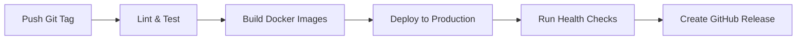

# 🏷️ Release Management Guide

This guide explains how to create releases for Kasa Monitor using the streamlined CI/CD pipeline approach.

## 📋 Release Process Overview

Kasa Monitor uses a **manual release process** where releases are triggered by creating and pushing Git tags. This ensures that:

- ✅ All code is tested before release
- ✅ Deployments are validated before release creation  
- ✅ You have full control over release timing
- ✅ Release notes are comprehensive and accurate

## 🚀 Creating a Release

### Step 1: Prepare Your Code

1. **Ensure your code is ready:**
   ```bash
   # Make sure you're on main branch
   git checkout main
   git pull origin main
   
   # Verify all tests pass locally
   npm test
   pytest backend/tests/
   ```

2. **Check CI/CD pipeline status:**
   - Go to GitHub Actions tab
   - Ensure latest main branch build is green ✅

### Step 2: Create and Push a Git Tag

Use semantic versioning (MAJOR.MINOR.PATCH):

```bash
# For bug fixes (patch release)
git tag v1.0.1
git push origin v1.0.1

# For new features (minor release)  
git tag v1.1.0
git push origin v1.1.0

# For breaking changes (major release)
git tag v2.0.0
git push origin v2.0.0
```

### Step 3: Monitor the Release Pipeline

After pushing the tag, the CI/CD pipeline will automatically:

1. **🔨 Build & Test** - Run all linting, security, and tests
2. **🐳 Build Docker Images** - Create multi-platform Docker images
3. **🚀 Deploy to Production** - Deploy to production environment
4. **🏥 Run Health Checks** - Validate deployment (skip smoke tests if no PRODUCTION_URL)
5. **📦 Create GitHub Release** - Generate release with changelog and Docker info

## 📊 Pipeline Workflow



## 🏷️ Semantic Versioning Guidelines

Follow these guidelines for version numbers:

### **PATCH (1.0.X)** - Bug Fixes
- Security fixes
- Bug corrections
- Performance improvements
- Documentation updates

**Example:** `v1.0.1`, `v1.0.2`

### **MINOR (1.X.0)** - New Features
- New features that don't break existing functionality
- API additions (non-breaking)
- New configuration options
- Enhanced functionality

**Example:** `v1.1.0`, `v1.2.0`

### **MAJOR (X.0.0)** - Breaking Changes
- API changes that break existing integrations
- Configuration format changes
- Database schema changes requiring migration
- Removal of deprecated features

**Example:** `v2.0.0`, `v3.0.0`

## 🐳 Docker Image Tags

Each release creates multiple Docker image tags:

### **Semantic Version Tags**
```bash
# Specific version
ghcr.io/xante8088/kasa-monitor:v1.2.3
ghcr.io/xante8088/kasa-monitor:1.2.3
ghcr.io/xante8088/kasa-monitor:1.2
ghcr.io/xante8088/kasa-monitor:1
```

### **Special Tags**
```bash
# Latest stable release
ghcr.io/xante8088/kasa-monitor:latest

# Platform-specific
ghcr.io/xante8088/kasa-monitor:pi5

# Commit SHA
ghcr.io/xante8088/kasa-monitor:abc1234
```

## 🔧 Release Without Production URL

If you don't have a production environment configured:

1. **Smoke tests will be skipped** - This is normal and expected
2. **Deployment will still succeed** - The job will complete successfully  
3. **Release will be created** - GitHub release will be generated normally

The pipeline is designed to work whether you have a production environment or not.

## 📝 Release Notes

Release notes are automatically generated and include:

- **Changelog** - All commits since the previous release
- **Docker Images** - Available image tags and pull commands
- **Quick Start** - Installation and usage instructions
- **Platform Support** - Multi-architecture information

## ⚠️ Troubleshooting

### **Release Pipeline Failed**

1. **Check the GitHub Actions logs:**
   - Go to Actions tab → Failed workflow
   - Click on the failed job to see detailed logs

2. **Common issues:**
   - **Build failures** - Fix code issues and create a new tag
   - **Test failures** - Fix failing tests and create a new tag
   - **Docker build issues** - Check Dockerfile and dependencies

3. **Retry a release:**
   ```bash
   # Delete the failed tag (if needed)
   git tag -d v1.0.1
   git push origin :refs/tags/v1.0.1
   
   # Fix issues and create new tag
   git tag v1.0.2
   git push origin v1.0.2
   ```

### **Missing Docker Images**

If Docker images weren't pushed:
- Check GitHub Container Registry permissions
- Verify GITHUB_TOKEN has packages:write permission
- Check Docker build logs in CI/CD pipeline

## 🎯 Best Practices

1. **Test before tagging** - Always ensure main branch is stable
2. **Use meaningful tag names** - Follow semantic versioning strictly  
3. **Write good commit messages** - They become part of release notes
4. **Test Docker images** - Verify images work before releasing
5. **Update documentation** - Keep README and docs current with releases
6. **Check dependencies** - Ensure all dependencies are up to date

## 📚 Related Documentation

- [CI/CD Pipeline Configuration](ci-cd.yml)
- [Docker Build Workflows](docker-build.yml)
- [Deployment Guide](DEPLOYMENT.md)
- [Contributing Guidelines](../CONTRIBUTING.md)