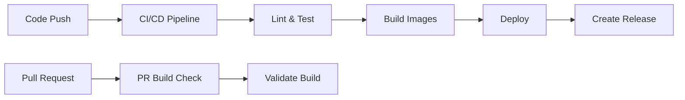

# GitHub Actions Workflows

## Overview

This repository uses GitHub Actions to automate builds, tests, deployments, and releases through a streamlined CI/CD pipeline.

## Workflows

### 1. `ci-cd.yml` - Complete CI/CD Pipeline

**Primary workflow** that handles the complete software lifecycle:

**Triggers:**
- ✅ Push to main/develop branches  
- ✅ Pull requests to main/develop
- ✅ Git tag pushes (for releases)

**What it does:**
- **Lint & Test** - Code quality and functionality validation
- **Security Scan** - Vulnerability and secrets detection
- **Build Docker Images** - Multi-platform builds (AMD64/ARM64)
- **Deploy** - Staging and production deployments
- **Create Releases** - GitHub releases with comprehensive notes

**Registry:** GitHub Container Registry (`ghcr.io`)

### 2. `docker-build-pr.yml` - Pull Request Validation

**Validates Docker builds on pull requests** without pushing images:

**Triggers:**
- ✅ Pull requests to main/develop branches
- ✅ Changes to Docker-related files

**What it does:**
- **Build Test** - Validates Docker image builds across platforms
- **No Push** - Only tests build process, doesn't create images
- **Fast Feedback** - Catches Docker issues early in PRs

### 3. `cleanup-docker.yml` & `manual-docker-cleanup.yml` - Image Management

**Automated and manual Docker image cleanup** to manage storage:

**Features:**
- **Scheduled Cleanup** - Weekly automated cleanup
- **Manual Cleanup** - On-demand cleanup with dry-run option
- **Package Detection** - Automatically finds correct packages
- **Configurable** - Set how many recent images to keep

## 🚀 Quick Start

### Creating a Release
```bash
# Create and push a git tag
git tag v1.0.0
git push origin v1.0.0

# CI/CD pipeline automatically:
# 1. Runs all tests and quality checks
# 2. Builds multi-platform Docker images  
# 3. Deploys to production
# 4. Creates GitHub release
```

### Manual Docker Cleanup
```bash
# Go to Actions → Manual Docker Cleanup → Run workflow
# Choose dry run to preview, then run for real cleanup
```

## 📋 Workflow Dependencies



## ⚙️ Configuration

### Environment Variables

**CI/CD Pipeline** uses these environment variables:
```yaml
DOCKER_REGISTRY: ghcr.io                # GitHub Container Registry
IMAGE_NAME: ${{ github.repository }}    # Full repository name
PYTHON_VERSION: '3.9'                   # Python version for tests
NODE_VERSION: '18'                      # Node.js version for frontend
```

### Manual Triggers

**CI/CD Pipeline** can be triggered manually:
```bash
# Via GitHub CLI
gh workflow run ci-cd.yml

# Via GitHub UI
# Go to Actions → CI/CD Pipeline → Run workflow
```

### Docker Image Cleanup

Configure cleanup frequency and retention:
- **Scheduled**: Weekly on Sundays at 2 AM UTC
- **Manual**: Configurable keep count (default: 10 images)
- **Dry run**: Preview what would be deleted

## 🔧 Troubleshooting

### Build Failures
1. Check GitHub Actions logs for specific error messages
2. Verify all tests pass locally before pushing
3. Check Docker build context and dependencies

### Missing Images  
1. Verify CI/CD pipeline completed successfully
2. Check GitHub Container Registry permissions
3. Ensure git tags are pushed correctly for releases

### Cleanup Issues
1. Check package permissions in repository settings
2. Verify package names match repository structure
3. Use dry run mode to debug cleanup issues

## 📚 Related Documentation

- [Release Management Guide](../RELEASES.md)
- [Deployment Configuration](../DEPLOYMENT.md)
- [CI/CD Pipeline](ci-cd.yml)
