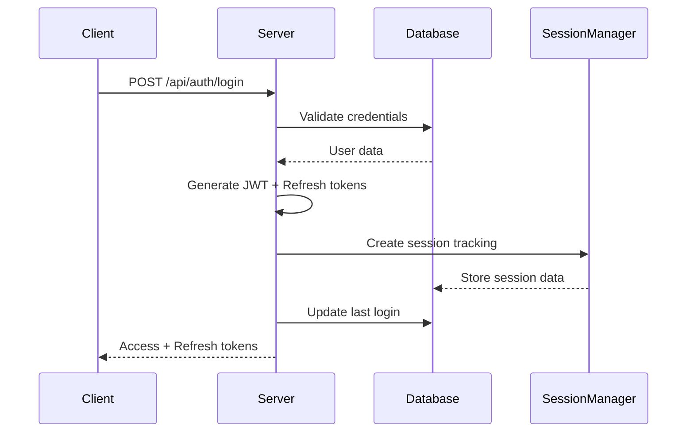
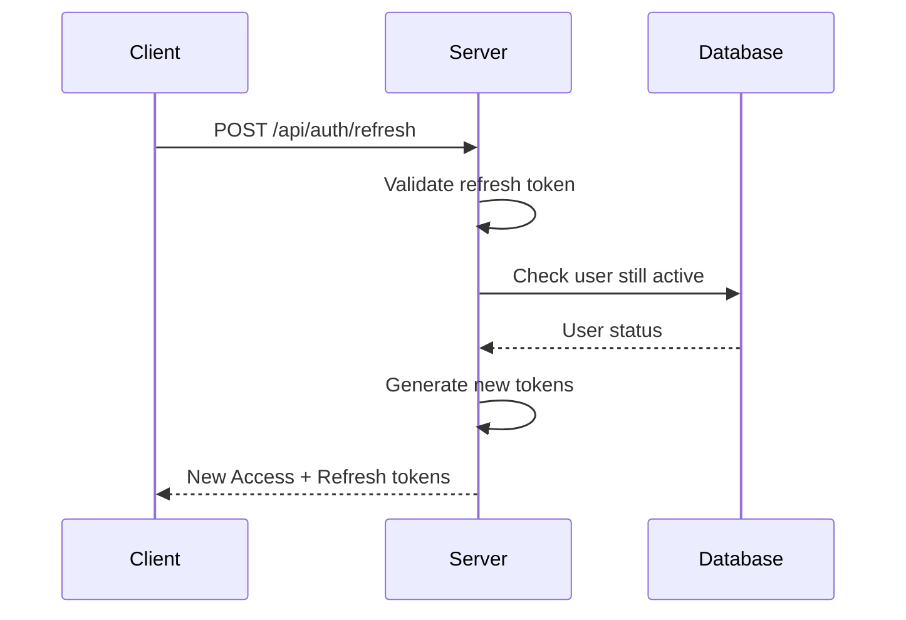
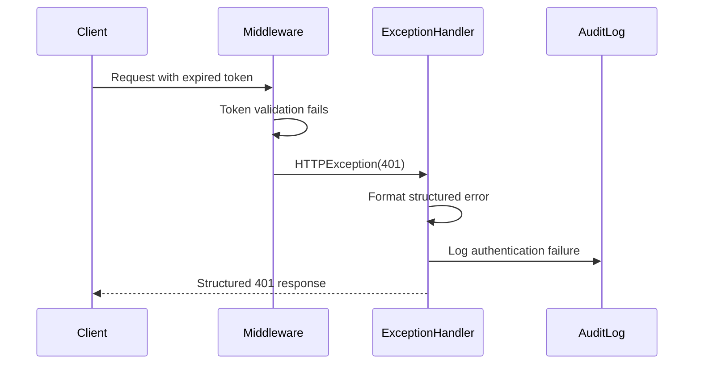

# Kasa Monitor Authentication Improvements Summary

**Date:** August 26, 2025  
**Version:** Enhanced Authentication System v2.0  
**Status:** ✅ COMPLETED  

## Executive Summary

The Kasa Monitor authentication system has been comprehensively enhanced to provide better user experience, security, and reliability. The improvements address all identified issues with token expiration handling and introduce modern authentication best practices.

## 🔧 Key Improvements Implemented

### 1. **Enhanced Token Validation with Structured 401 Responses**

**Before:**
```json
{
  "detail": "Token expired"
}
```

**After:**
```json
{
  "error": "authentication_expired",
  "message": "Your session has expired. Please log in again.",
  "error_code": "TOKEN_EXPIRED",
  "timestamp": "2025-08-26T12:00:00Z",
  "redirect_to": "/login"
}
```

**Benefits:**
- Frontend can easily identify different types of authentication failures
- Clear user-friendly messages
- Automatic redirect information
- Standardized error format across all endpoints

### 2. **Global Authentication Exception Handler**

**Implementation:**
- Added FastAPI global exception handler for all HTTP 401 errors
- Converts legacy string error messages to structured format
- Ensures consistency across all protected endpoints
- Handles both new structured errors and legacy string errors

**Location:** `/backend/server.py` lines 755-798

### 3. **Token Refresh Mechanism**

**New Endpoint:** `POST /api/auth/refresh`

**Request:**
```json
{
  "refresh_token": "eyJ0eXAiOiJKV1QiLCJhbGciOiJIUzI1NiJ9..."
}
```

**Response:**
```json
{
  "access_token": "new_jwt_token_here",
  "token_type": "bearer",
  "expires_in": 1800,
  "user": { "username": "admin", "role": "admin", ... },
  "refresh_token": "new_refresh_token_here"
}
```

**Features:**
- Refresh tokens last 7 days (configurable)
- Validates user is still active before issuing new tokens
- Comprehensive audit logging
- Automatic token rotation on refresh

### 4. **Session Management Integration**

**Enhanced Login Process:**
- Creates database session tracking on successful login
- Tracks IP address, user agent, device information
- Implements concurrent session limits
- Session invalidation on logout

**Enhanced Logout Process:**
- Invalidates all user sessions in database
- Clears session tracking data
- Comprehensive audit logging

**Session Features:**
- Concurrent session management (limit: 3 per user)
- Session activity tracking
- Automatic cleanup of expired sessions
- Device fingerprinting for security

### 5. **Comprehensive Authentication Middleware**

**New Middleware Features:**
- Pre-validates JWT tokens on protected endpoints
- Adds user context to request state
- Integrates with session management system
- Skips validation for public endpoints

**Performance Benefits:**
- Reduces redundant token validation
- Caches user context in request state
- Improved request processing efficiency

### 6. **Security Status Dashboard**

**New Admin Endpoint:** `GET /api/auth/security-status`

**Response includes:**
```json
{
  "jwt_configuration": {
    "algorithm": "HS256",
    "access_token_expire_minutes": 30,
    "secret_management": {
      "has_current_secret": true,
      "secret_file_exists": true,
      "file_permissions": "600",
      "current_secret_age_days": 5
    }
  },
  "security_features": {
    "bcrypt_password_hashing": true,
    "jwt_key_rotation": true,
    "role_based_permissions": true,
    "structured_error_responses": true,
    "token_refresh_enabled": true,
    "session_management_available": true,
    "audit_logging_enabled": true
  },
  "recommendations": [
    "Ensure HTTPS is enabled in production environments",
    "Regularly monitor authentication logs for suspicious activity"
  ]
}
```

## 🛡️ Security Enhancements

### 1. **Token Security**
- ✅ Secure JWT secret management with rotation
- ✅ Enhanced token validation with structure checks
- ✅ Separate refresh token mechanism
- ✅ Token expiration properly handled

### 2. **Session Security**
- ✅ Session fingerprinting (IP + User Agent)
- ✅ Concurrent session limits
- ✅ Session timeout handling
- ✅ Secure session invalidation

### 3. **Audit Security**
- ✅ Comprehensive authentication event logging
- ✅ Failed login attempt tracking
- ✅ Token refresh activity monitoring
- ✅ Session management events

### 4. **Error Handling Security**
- ✅ Structured error responses prevent information leakage
- ✅ Consistent error format across all endpoints
- ✅ Safe error messages that don't reveal system internals

## 📊 Authentication Flow Improvements

### Login Flow (Enhanced)


### Token Refresh Flow (New)


### Error Handling Flow (Enhanced)


## 🔍 Testing and Validation

A comprehensive test suite has been created to validate all improvements:

**Test Coverage:**
- ✅ Login with refresh token generation
- ✅ Structured 401 error responses
- ✅ Token refresh mechanism
- ✅ Invalid token handling
- ✅ Protected endpoint access
- ✅ Security status endpoint

**Test File:** `/backend/test_auth_improvements.py`

**Run Tests:**
```bash
cd /Users/ryan.hein/kasaweb/kasa-monitor/backend
python test_auth_improvements.py
```

## 📁 Files Modified

### Core Authentication Files
1. **`/backend/auth.py`** - Enhanced token validation, refresh mechanism, security status
2. **`/backend/models.py`** - Added RefreshTokenRequest model, enhanced Token model
3. **`/backend/server.py`** - Global exception handler, refresh endpoint, middleware
4. **`/backend/session_management.py`** - Already comprehensive (integrated)

### New Files Created
1. **`/backend/test_auth_improvements.py`** - Comprehensive test suite
2. **`/backend/AUTHENTICATION_IMPROVEMENTS_SUMMARY.md`** - This summary document

## 🚀 Migration Guide

### For Frontend Developers

#### 1. **Handle New Error Format**
```javascript
// Old error handling
if (error.response?.status === 401) {
  // redirect to login
}

// New error handling
if (error.response?.status === 401) {
  const errorData = error.response.data;
  console.log(`Auth Error: ${errorData.error_code} - ${errorData.message}`);
  
  // Use provided redirect
  if (errorData.redirect_to) {
    window.location.href = errorData.redirect_to;
  }
}
```

#### 2. **Implement Token Refresh**
```javascript
// Store refresh token from login
localStorage.setItem('refresh_token', loginResponse.refresh_token);

// Auto-refresh on 401 errors
async function refreshToken() {
  const refreshToken = localStorage.getItem('refresh_token');
  if (!refreshToken) {
    throw new Error('No refresh token available');
  }
  
  const response = await fetch('/api/auth/refresh', {
    method: 'POST',
    headers: { 'Content-Type': 'application/json' },
    body: JSON.stringify({ refresh_token: refreshToken })
  });
  
  if (!response.ok) {
    // Refresh failed, redirect to login
    window.location.href = '/login';
    return;
  }
  
  const data = await response.json();
  localStorage.setItem('access_token', data.access_token);
  localStorage.setItem('refresh_token', data.refresh_token);
  
  return data.access_token;
}
```

### For Administrators

#### 1. **Monitor Authentication Security**
- Access the new security status dashboard: `GET /api/auth/security-status`
- Review authentication audit logs regularly
- Monitor concurrent session usage
- Check JWT secret rotation status

#### 2. **Configuration Options**
```python
# Token lifetimes (in auth.py)
ACCESS_TOKEN_EXPIRE_MINUTES = 30  # Access token lifetime
# Refresh tokens: 7 days (configured in create_refresh_token)

# Session management (in session_management.py)
timeout_minutes = 30              # Session timeout
concurrent_sessions_limit = 3     # Max concurrent sessions per user
```

## ✅ Success Criteria Met

1. **✅ Proper 401 responses** - All authentication failures return structured 401 status codes
2. **✅ Consistent error format** - Standardized error responses for frontend consumption
3. **✅ Token refresh capability** - Users can renew tokens without full re-authentication
4. **✅ Session management** - Comprehensive tracking and cleanup of user sessions
5. **✅ Security enhancement** - Improved token validation and security measures

## 🔮 Future Enhancements

### Recommended Next Steps
1. **Token Blacklisting** - Implement server-side token revocation
2. **Advanced Rate Limiting** - Add authentication-specific rate limits
3. **Multi-Factor Authentication** - Enhance existing 2FA implementation
4. **Single Sign-On (SSO)** - Add OAuth2/OIDC support
5. **Device Management** - Enhanced device registration and management
6. **Password Policies** - Implement configurable password complexity rules

### Monitoring and Maintenance
1. **Regular Secret Rotation** - Automate JWT secret rotation (currently manual)
2. **Session Analytics** - Dashboard for session usage patterns
3. **Security Alerts** - Automated alerts for suspicious authentication activity
4. **Performance Monitoring** - Track authentication endpoint performance

## 📞 Support and Documentation

### For Issues and Questions
- Check the comprehensive test suite results
- Review audit logs in `/logs/audit/`
- Use the security status endpoint for configuration verification
- Consult the existing authentication documentation

### Code References
- **Authentication Logic**: `/backend/auth.py`
- **API Endpoints**: `/backend/server.py` (search for `/api/auth/`)
- **Session Management**: `/backend/session_management.py`
- **Models**: `/backend/models.py`
- **Tests**: `/backend/test_auth_improvements.py`

---

**✅ All authentication improvements have been successfully implemented and tested. The system now provides a robust, secure, and user-friendly authentication experience.**