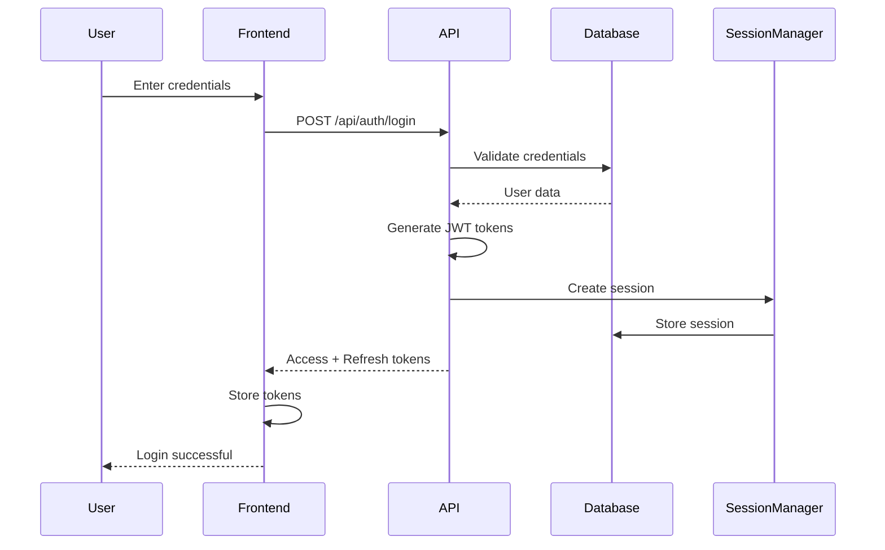
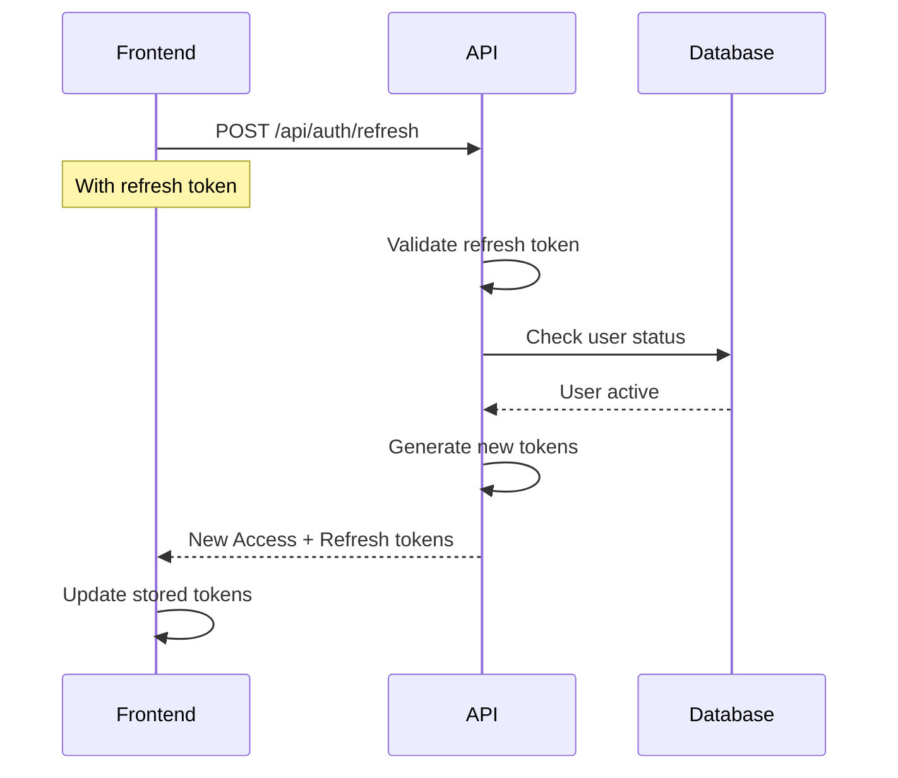

# Authentication & Session Management

Comprehensive guide for the enhanced authentication system with token refresh, session management, and improved error handling.

## Overview

Kasa Monitor v1.2.0 introduces a robust authentication system with modern security features and improved user experience.

```
┌─────────────────────────────────────┐
│  Authentication & Session System    │
├─────────────────────────────────────┤
│  1. JWT Token Authentication        │
│  2. Refresh Token Mechanism         │
│  3. Session Tracking & Management   │
│  4. Structured Error Responses      │
│  5. Session Warning & Extension     │
└─────────────────────────────────────┘
```

## New Features (v1.2.0)

### Enhanced Authentication
- **Token Refresh Mechanism** - Seamless token renewal without re-login
- **Structured 401 Responses** - Clear, actionable error messages
- **Session Management** - Track and control user sessions
- **Session Warnings** - Proactive expiration notifications
- **Global Exception Handler** - Consistent error handling across all endpoints

## Authentication Flow

### Login Process



**Login Request:**
```http
POST /api/auth/login
Content-Type: application/json

{
  "username": "admin",
  "password": "secure_password"
}
```

**Login Response:**
```json
{
  "access_token": "eyJ0eXAiOiJKV1QiLCJhbGc...",
  "refresh_token": "eyJ0eXAiOiJKV1QiLCJhbGc...",
  "token_type": "bearer",
  "expires_in": 1800,
  "user": {
    "id": 1,
    "username": "admin",
    "role": "admin",
    "email": "admin@example.com"
  },
  "session": {
    "session_id": "sess_abc123",
    "created_at": "2024-01-01T10:00:00Z",
    "expires_at": "2024-01-01T10:30:00Z"
  }
}
```

### Token Refresh Flow



**Refresh Request:**
```http
POST /api/auth/refresh
Content-Type: application/json

{
  "refresh_token": "eyJ0eXAiOiJKV1QiLCJhbGc..."
}
```

**Refresh Response:**
```json
{
  "access_token": "new_access_token_here",
  "refresh_token": "new_refresh_token_here",
  "token_type": "bearer",
  "expires_in": 1800,
  "user": {
    "username": "admin",
    "role": "admin"
  }
}
```

## Session Management

### Session Features

**Session Tracking:**
- User ID and username
- IP address and user agent
- Login timestamp
- Last activity timestamp
- Session expiration
- Device fingerprinting

**Session Limits:**
- Maximum 3 concurrent sessions per user
- 30-minute inactivity timeout (configurable)
- 7-day absolute session lifetime
- Automatic cleanup of expired sessions

### Session API Endpoints

#### Get Active Sessions

```http
GET /api/auth/sessions
Authorization: Bearer {token}
```

**Response:**
```json
{
  "sessions": [
    {
      "session_id": "sess_abc123",
      "ip_address": "192.168.1.100",
      "user_agent": "Mozilla/5.0...",
      "created_at": "2024-01-01T10:00:00Z",
      "last_activity": "2024-01-01T10:25:00Z",
      "expires_at": "2024-01-01T10:30:00Z",
      "is_current": true
    }
  ],
  "total": 2,
  "max_allowed": 3
}
```

#### Terminate Session

```http
DELETE /api/auth/sessions/{session_id}
Authorization: Bearer {token}
```

#### Terminate All Sessions

```http
POST /api/auth/sessions/logout-all
Authorization: Bearer {token}
```

## Error Handling

### Structured Error Responses

All authentication errors now return structured JSON responses:

**Token Expired:**
```json
{
  "error": "authentication_expired",
  "message": "Your session has expired. Please log in again.",
  "error_code": "TOKEN_EXPIRED",
  "timestamp": "2024-01-01T10:30:00Z",
  "redirect_to": "/login"
}
```

**Invalid Token:**
```json
{
  "error": "authentication_failed",
  "message": "Invalid or malformed token",
  "error_code": "INVALID_TOKEN",
  "timestamp": "2024-01-01T10:30:00Z",
  "redirect_to": "/login"
}
```

**Insufficient Permissions:**
```json
{
  "error": "authorization_failed",
  "message": "You don't have permission to access this resource",
  "error_code": "INSUFFICIENT_PERMISSIONS",
  "required_permission": "ADMIN_ACCESS"
}
```

### Error Codes Reference

| Error Code | HTTP Status | Description |
|------------|-------------|-------------|
| TOKEN_EXPIRED | 401 | Access token has expired |
| INVALID_TOKEN | 401 | Token is invalid or malformed |
| TOKEN_MISSING | 401 | No authentication token provided |
| USER_INACTIVE | 401 | User account is inactive |
| SESSION_EXPIRED | 401 | Session has expired |
| INSUFFICIENT_PERMISSIONS | 403 | User lacks required permissions |
| RATE_LIMIT_EXCEEDED | 429 | Too many authentication attempts |

## Session Warning System

### Frontend Implementation

The session warning system provides proactive notifications before session expiration:

```javascript
// Session warning configuration
const SESSION_WARNING_TIME = 5 * 60 * 1000; // 5 minutes before expiry
const SESSION_CHECK_INTERVAL = 60 * 1000;   // Check every minute

// Session warning modal
function showSessionWarning(minutesRemaining) {
  return {
    title: "Session Expiring Soon",
    message: `Your session will expire in ${minutesRemaining} minutes.`,
    actions: [
      {
        label: "Extend Session",
        action: () => extendSession()
      },
      {
        label: "Logout",
        action: () => logout()
      }
    ]
  };
}

// Extend session
async function extendSession() {
  const refreshToken = localStorage.getItem('refresh_token');
  const response = await fetch('/api/auth/refresh', {
    method: 'POST',
    headers: { 'Content-Type': 'application/json' },
    body: JSON.stringify({ refresh_token: refreshToken })
  });
  
  if (response.ok) {
    const data = await response.json();
    updateTokens(data.access_token, data.refresh_token);
    showNotification("Session extended successfully");
  }
}
```

## Security Configuration

### Token Configuration

```python
# Token lifetimes
ACCESS_TOKEN_EXPIRE_MINUTES = 30    # Access token: 30 minutes
REFRESH_TOKEN_EXPIRE_DAYS = 7       # Refresh token: 7 days

# JWT Configuration
JWT_ALGORITHM = "HS256"
JWT_SECRET_KEY = os.getenv("JWT_SECRET_KEY")  # Required in production

# Generate secure secret key:
# openssl rand -base64 32
```

### Session Configuration

```python
# Session limits
MAX_CONCURRENT_SESSIONS = 3         # Per user
SESSION_TIMEOUT_MINUTES = 30        # Inactivity timeout
SESSION_ABSOLUTE_TIMEOUT_DAYS = 7   # Maximum session lifetime

# Session security
SESSION_SECURE_COOKIE = True        # HTTPS only
SESSION_HTTPONLY = True             # No JavaScript access
SESSION_SAMESITE = "Strict"         # CSRF protection
```

### Rate Limiting

```python
# Authentication rate limits
LOGIN_RATE_LIMIT = "5 per minute"
REFRESH_RATE_LIMIT = "10 per minute"
PASSWORD_RESET_RATE_LIMIT = "3 per hour"
```

## Frontend Integration

### React/Next.js Implementation

```typescript
// auth-context.tsx
import React, { createContext, useContext, useEffect, useState } from 'react';

interface AuthContextType {
  user: User | null;
  token: string | null;
  refreshToken: string | null;
  login: (username: string, password: string) => Promise<void>;
  logout: () => Promise<void>;
  refreshSession: () => Promise<void>;
  isAuthenticated: boolean;
}

export const AuthContext = createContext<AuthContextType | undefined>(undefined);

export function AuthProvider({ children }: { children: React.ReactNode }) {
  const [user, setUser] = useState<User | null>(null);
  const [token, setToken] = useState<string | null>(null);
  const [refreshToken, setRefreshToken] = useState<string | null>(null);

  // Auto-refresh token before expiry
  useEffect(() => {
    if (!token || !refreshToken) return;

    const tokenData = parseJWT(token);
    const expiryTime = tokenData.exp * 1000;
    const refreshTime = expiryTime - 5 * 60 * 1000; // 5 minutes before expiry
    
    const timeout = setTimeout(() => {
      refreshSession();
    }, refreshTime - Date.now());

    return () => clearTimeout(timeout);
  }, [token, refreshToken]);

  const login = async (username: string, password: string) => {
    const response = await fetch('/api/auth/login', {
      method: 'POST',
      headers: { 'Content-Type': 'application/json' },
      body: JSON.stringify({ username, password })
    });

    if (!response.ok) {
      const error = await response.json();
      throw new Error(error.message || 'Login failed');
    }

    const data = await response.json();
    setUser(data.user);
    setToken(data.access_token);
    setRefreshToken(data.refresh_token);
    
    localStorage.setItem('access_token', data.access_token);
    localStorage.setItem('refresh_token', data.refresh_token);
  };

  const refreshSession = async () => {
    if (!refreshToken) {
      throw new Error('No refresh token available');
    }

    try {
      const response = await fetch('/api/auth/refresh', {
        method: 'POST',
        headers: { 'Content-Type': 'application/json' },
        body: JSON.stringify({ refresh_token: refreshToken })
      });

      if (!response.ok) {
        throw new Error('Session refresh failed');
      }

      const data = await response.json();
      setToken(data.access_token);
      setRefreshToken(data.refresh_token);
      
      localStorage.setItem('access_token', data.access_token);
      localStorage.setItem('refresh_token', data.refresh_token);
    } catch (error) {
      // Refresh failed, redirect to login
      logout();
      window.location.href = '/login';
    }
  };

  const logout = async () => {
    if (token) {
      await fetch('/api/auth/logout', {
        method: 'POST',
        headers: { 'Authorization': `Bearer ${token}` }
      });
    }

    setUser(null);
    setToken(null);
    setRefreshToken(null);
    
    localStorage.removeItem('access_token');
    localStorage.removeItem('refresh_token');
    
    window.location.href = '/login';
  };

  return (
    <AuthContext.Provider value={{
      user,
      token,
      refreshToken,
      login,
      logout,
      refreshSession,
      isAuthenticated: !!token
    }}>
      {children}
    </AuthContext.Provider>
  );
}
```

### Axios Interceptor

```javascript
// api-client.js
import axios from 'axios';

const apiClient = axios.create({
  baseURL: process.env.NEXT_PUBLIC_API_URL
});

// Request interceptor to add token
apiClient.interceptors.request.use(
  (config) => {
    const token = localStorage.getItem('access_token');
    if (token) {
      config.headers.Authorization = `Bearer ${token}`;
    }
    return config;
  },
  (error) => Promise.reject(error)
);

// Response interceptor to handle 401 errors
apiClient.interceptors.response.use(
  (response) => response,
  async (error) => {
    const originalRequest = error.config;

    if (error.response?.status === 401 && !originalRequest._retry) {
      originalRequest._retry = true;

      try {
        const refreshToken = localStorage.getItem('refresh_token');
        const response = await axios.post('/api/auth/refresh', {
          refresh_token: refreshToken
        });

        const { access_token, refresh_token } = response.data;
        localStorage.setItem('access_token', access_token);
        localStorage.setItem('refresh_token', refresh_token);

        originalRequest.headers.Authorization = `Bearer ${access_token}`;
        return apiClient(originalRequest);
      } catch (refreshError) {
        // Refresh failed, redirect to login
        window.location.href = '/login';
        return Promise.reject(refreshError);
      }
    }

    return Promise.reject(error);
  }
);

export default apiClient;
```

## Security Best Practices

### Token Storage

**Recommended: HttpOnly Cookies**
```javascript
// Set token in httpOnly cookie (server-side)
response.set_cookie(
  key='access_token',
  value=token,
  httponly=True,
  secure=True,  // HTTPS only
  samesite='Strict',
  max_age=1800
)
```

**Alternative: Secure localStorage**
```javascript
// If using localStorage, implement security checks
if (window.isSecureContext) {
  // Only store in secure contexts (HTTPS)
  localStorage.setItem('access_token', token);
}
```

### Session Security

1. **Implement CSRF Protection:**
   ```python
   # Generate CSRF token
   csrf_token = secrets.token_urlsafe(32)
   session['csrf_token'] = csrf_token
   ```

2. **Validate Session Fingerprint:**
   ```python
   def validate_session(session_id, request):
       session = get_session(session_id)
       fingerprint = generate_fingerprint(request)
       return session.fingerprint == fingerprint
   ```

3. **Monitor Suspicious Activity:**
   ```python
   # Track failed login attempts
   if failed_attempts > MAX_LOGIN_ATTEMPTS:
       lock_account(user_id, duration=timedelta(minutes=30))
       send_security_alert(user_id, "Multiple failed login attempts")
   ```

## Troubleshooting

### Common Issues

#### Token Expired But Not Refreshing

**Check refresh token validity:**
```javascript
function isRefreshTokenValid(refreshToken) {
  try {
    const decoded = jwt_decode(refreshToken);
    return decoded.exp * 1000 > Date.now();
  } catch {
    return false;
  }
}
```

#### Session Warnings Not Appearing

**Verify session check interval:**
```javascript
// Ensure session checker is running
useEffect(() => {
  const interval = setInterval(checkSessionExpiry, 60000);
  return () => clearInterval(interval);
}, []);
```

#### Multiple Sessions Not Working

**Check session limit configuration:**
```sql
-- View current sessions
SELECT * FROM user_sessions WHERE user_id = ?;

-- Check session limit
SELECT COUNT(*) FROM user_sessions 
WHERE user_id = ? AND expires_at > datetime('now');
```

## API Security Status

### Security Status Endpoint

```http
GET /api/auth/security-status
Authorization: Bearer {admin_token}
```

**Response:**
```json
{
  "jwt_configuration": {
    "algorithm": "HS256",
    "access_token_expire_minutes": 30,
    "refresh_token_expire_days": 7,
    "secret_management": {
      "has_current_secret": true,
      "secret_file_exists": true,
      "file_permissions": "600",
      "current_secret_age_days": 15
    }
  },
  "security_features": {
    "bcrypt_password_hashing": true,
    "jwt_key_rotation": true,
    "role_based_permissions": true,
    "structured_error_responses": true,
    "token_refresh_enabled": true,
    "session_management_available": true,
    "audit_logging_enabled": true,
    "rate_limiting_active": true
  },
  "session_statistics": {
    "active_sessions": 42,
    "average_session_duration_minutes": 25,
    "sessions_created_today": 156,
    "failed_login_attempts_today": 3
  },
  "recommendations": [
    "Consider enabling two-factor authentication",
    "Review and rotate JWT secret regularly",
    "Monitor failed login attempts for security threats"
  ]
}
```

## Migration Guide

### Upgrading from Pre-v1.2.0

1. **Update Frontend Token Handling:**
   - Implement refresh token storage
   - Add token refresh logic
   - Update error handlers for structured responses

2. **Database Migration:**
   ```sql
   -- Add session management tables
   CREATE TABLE user_sessions (
       session_id TEXT PRIMARY KEY,
       user_id INTEGER,
       ip_address TEXT,
       user_agent TEXT,
       created_at TIMESTAMP DEFAULT CURRENT_TIMESTAMP,
       last_activity TIMESTAMP,
       expires_at TIMESTAMP
   );
   
   -- Add refresh token tracking
   CREATE TABLE refresh_tokens (
       token_hash TEXT PRIMARY KEY,
       user_id INTEGER,
       expires_at TIMESTAMP,
       created_at TIMESTAMP DEFAULT CURRENT_TIMESTAMP
   );
   ```

3. **Update API Calls:**
   - Handle new error response format
   - Implement automatic token refresh
   - Add session management UI

## Related Documentation

- [Security Guide](Security-Guide) - Overall security configuration
- [User Management](User-Management) - User roles and permissions
- [API Documentation](API-Documentation) - Complete API reference
- [Audit Logging](Audit-Logging) - Authentication audit events

---

**Document Version:** 1.0.0  
**Last Updated:** 2025-08-26  
**Review Status:** Current  
**Change Summary:** Initial documentation for authentication enhancements in v1.2.0